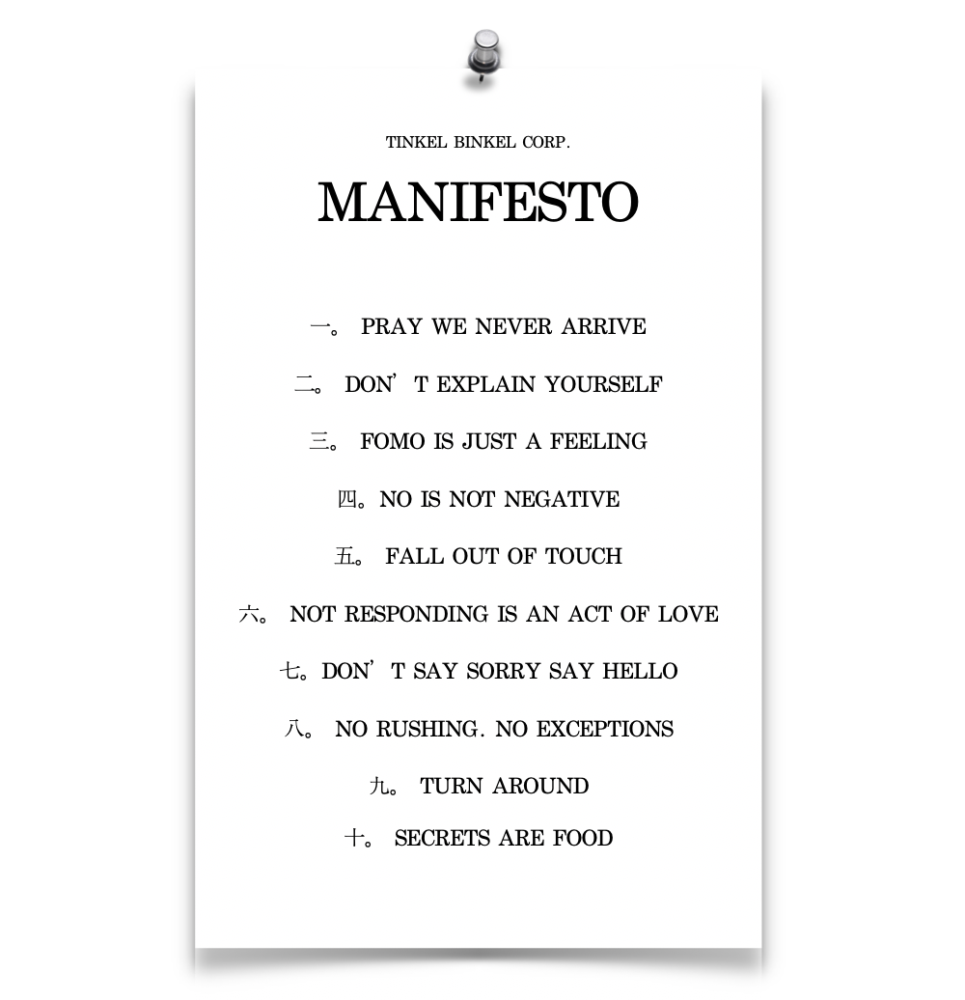
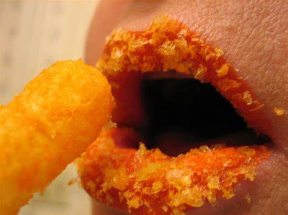
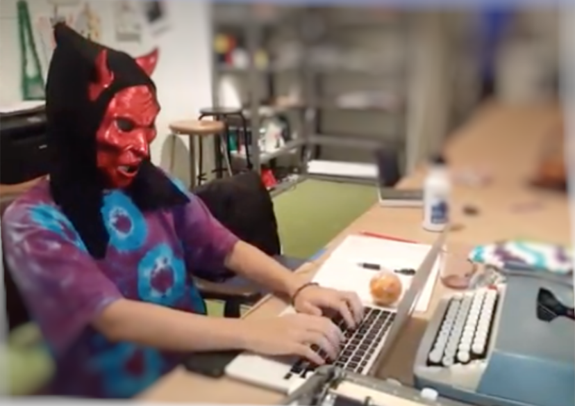
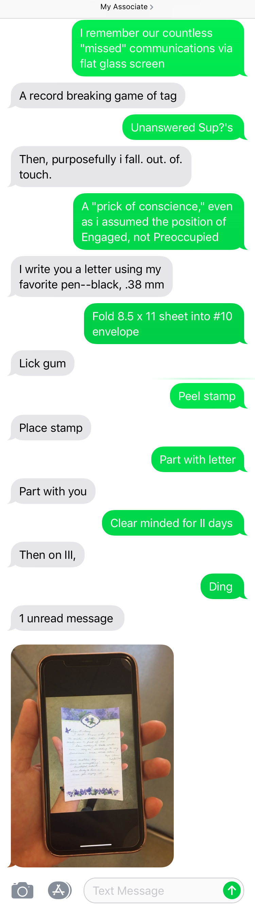
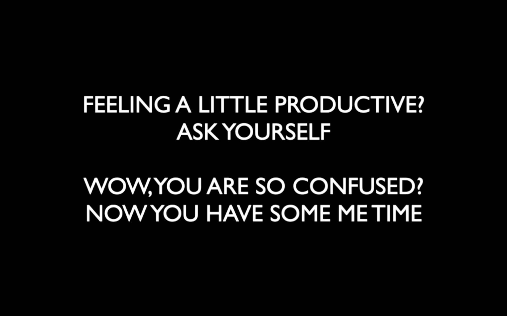
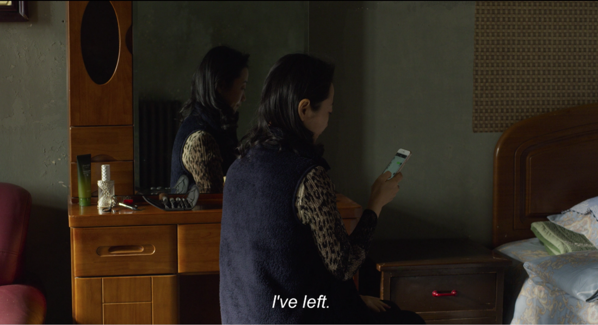

    Why is it unbearable to not know?

    

##### For more information on how to implement this tool, dial TOLL FREE: 1-800-TKL-BNKL or e-mail us at tinkelbinkelcorp@gmail.com

Dear Associate,

I once worked as a courier for Postmates, the grub and goods delivery service. Back in the company’s youth, when on-demand services were not yet the norm. I used to marvel at how the Dispatch center always knew my location through the data divulged to them by my company phone. If I was waiting outside a restaurant for a bowl of noodles to be prepared, and the allotted time of one hour for my delivery was nearly up, Dispatch would send me a text inquiring what was wrong. If a customer changed their order, and wanted me to pick up a package of cheese in addition to their groceries, Dispatch would alert me. The option to constantly communicate, and to do so immediately, allowed customers to change their minds impulsively. Dispatch would send me a flurry of messages with new instructions, altering my route from the original plan. Rather than committing to a single journey, the constant use of devices allowed each delivery route to be adjusted for _optimum customer satisfaction_, an experience which, in actuality, can scatter the focus of all involved.

One time, in a hustle to complete a delivery, I inserted a box of one of those gourmet thin-crust pizzas vertically into my bike bag. The pizza promptly crumpled upon itself, much like a silk scarf in its box. I felt a sinking feeling that I shouldn’t have turned the box on its side. I swept the feeling under the rug, however, and pedaled on. Much like Schrodinger's Cat, I had no knowledge whether or not the pizza had in fact crumpled, and decided to maintain ignorance.
The pizza’s target turned out to be a Postmates dispatcher himself. I step into the company headquarters—a second-floor office space at the time—and deliver the meal with friendly eyes, full of violent positivity. Just as the Transparency Society would have it. A few minutes after leaving the office, I receive a text from the dispatcher. _More careful next time :]_, followed by a photo of the wreckage of the crumpled pizza lying stained in its box.

The ability to send messages without cessation collapsed space and time. I wondered: if this had happened prior to texting’s prevalence, how would the situation have transpired? Would the Dispatcher not have informed me of the crumpled pizza, feeling that it was nothing to worry about? Or, feeling that a courier must practice more care during delivery, would the Dispatcher inform me of the crumpled pizza in person? If this was the case, I would hear the vibrations of the Dispatcher’s true voice and tone as we conversed in person. A skim of the fingerpads against the screen allowed me and the Dispatcher to communicate about the crumpled pizza. I  had no knowledge of how he actually related to the situation, for all I had to work with were a few tiny Helvetica ants produced by his fingers. The absence of voice, of spirit1, is cause for those seemingly endless conversations we are forced to engage in these days, trying to pick apart the inner meanings of text messages2. Due to the casual, ease-filled nature of texting, we are taught to treat situations as _Not a Big Deal. It’s no biggie. Let’s keep it positive, guys!_ When we feel something is, in fact, A Big Deal, or simply Is, we are left unprepared for discussing deviations from plan, uncertainty, bumpiness, pain.

A Postmates order that doesn’t arrive when expected constitutes a grave transgression to the smoothly-oiled order of transparency society3. Transparency society grooms Postmates customers to grow anxious if an order of chili cheese fries is late. The transparency society presumes humans to be so in control of our technology and universe that any deviation from the expected arrival time is regarded as flaw, or as someone’s fault. The technologies available at present allow instant contact with one another to be normalized to the point that we feel anxious if something does not go according to plan.

Before Location Services allowed individuals and companies to surveil one another, I breathed easier. If I was going to arrive six minutes after a decided-upon meeting time, there _simply was no way_ to inform a friend of the situation. Now, the option to communicate my whereabouts, not to mention the _staggering systemic pressure to do so_, has radically shifted societal standards for communication, so much so that _not_ informing my friend of my precise arrival time constitutes a failure of consideration, a transgression of that smoothly-oiled plan. Such unrealistic, oversimplified norms lead, in turn, to oversimplified perceptions of our relations with one another.

The pressure to communicate incessantly frames situations previously perceived as mere occurrences within the vast mystery of the universe, as interpersonal issues, complete with individualized notions of blame and responsibility. Showing up after an agreed-upon time could constitute a lack of care, an error of friendship, a personal transgression—as if one could control traffic, or the wind that blows through the carob trees outside one’s house, or the indigestion of one’s puppy, or any number of fleeting factors present in a day. As if, when “running late,” putting on one’s socks before heading out the door, one is actively attempting to thwart a meet-up. I thought we were in this together? What, my dear Associate, does this all stem from?

Apologizing for one’s 5-minute lateness takes root in the notion that one can control the universe in the first place. The rapid flattening of society hinges upon this principle. You run the world! Here lies the problem. Why not consider this: DON’T EXPLAIN YOURSELF.

    

##### DO YOU BELIEVE YOU CAN CONTROL THE UNIVERSE?

Qin ai de Associate:

I delighted in reading your letter today. As my associate, you do recall that I enter into a meditative state while washing the dishes, don’t you? Recently, during my post-meal routine, I was interrupted by the dreaded cry of my device: ding, and a few moments after: ding. My hands dripped with sudsy water, not half of the dishes were done, but I was overtaken by an itch at the back of my mind—a voracious pull possessed me as I withered into a passive automaton rushing my task to attend to a ghost4. I later pondered that if the author of the message had been in the room with me, I would gladly respond to their voice while washing the dishes. How is it so that without the physical presence of my friend I suddenly feel clenched in the grip of their whim?—in the middle of my solitary ritual! A “friendly” ding transports my psyche from here to, not exactly there, but somewhere, decidedly not, here. No tone of nagging or urgency had even been uttered. Yet the technology diverted my attention away from the sublime iridescent bubbles and scalding water on my skin, toward a conversator who was not even there. What is this feeling within me that begs I respond RIGHT NOW, anxious at the minutes passing in which I do not answer the query? In fact, continuing on with my dishes is not not responding— the two acts are unrelated. Only the unfeasible norms of hyper-technological society dictate that my dishwashing is occurring as an act of opposition to my friend’s note.

In pursuit of our mutual health, I decided that not responding is an act of love. What say you of that, my dear associate?

    

##### Longing is fun! Longing needs no remedy.

Dearest Associate,

The transparency society collapses time and space, flattening our lives. Have you ever craved to hear a particular song, but found yourself on a rocky train in the desert, far from your boombox? If so, did you stay craving, or did you command the song from your phone, through a mere skim of finger pad to screen? Not much intention is needed here. Have you ever missed a TV show? No matter, you can view it later on your computer. It does not matter _when_ or _where_ you do anything anymore because you can do anything, anywhere, anytime. I can forget where I am. The experience flattens. I can feel my psyche flattening, too. No longer does my physical body, or its distance from what it desires, need to get in the way. Not the season for blueberries where you live? The physical realm no longer presents a barrier you must heed. You can eat blueberries at a breakfast table across the world from where the berries were grown. The need to pay attention to your surrounding environment and its specifics dissipates—_(What grows there this time of year; what’s the weather like today?)_— because you need not even leave your home to procure the blueberries to eat. You can have them delivered to your door while you work. Work anywhere, eat anywhere.

Soon, will there be anything left to crave? Contrary to what the transparency society would like us to believe, longing needs no remedy. You need not respond to every impulse that enters your body, or every message you receive, as contemporary standards for communication pressure us to believe. In fact, the challenge (perceived nowadays as negative) of longing can be the root of true, deep contentment. If you can so “conveniently” collapse the distance between You and What You Long For, where does the desire, the depth come in? I fear, my cherished Associate, that the ability to instantly obtain whatever thought flicked through your mind eradicates any need to think more deeply about anything. We now have such vast, immediate, access to so many words, so many informations, that the pleasure of looking up a single word, a once physical and thoughtful act, has become all too convenient. We have developed instant access to such vast swarms of information. _What fun! How educational. What a great resource._ These are without doubt. And still, our bodies remain—we cannot hold It All, so we grow anxious, overfilled, unintentional, and reckless.

What does this do for our brains-bodies, the lack of break between actions, the continuum, the lack of distinction among spaces and times, the disintegration of rituals once practiced in certain locales? If our minds no longer need to distinguish  when we do what, will we continue to grow more and more care-free, care-less?

    

##### No good nor bad—only evil!

     

##### My letter in your palm

    

My Associate,

Have you ever considered that an e-mail takes a mere second to be received? Our ability to reply in one second has rendered the _other_ option—the decision to _not_ answer—as something negative. When we don’t answer we generate a gap in space + time—a cosmic breath, which, in transparency society, is seen as a _lack_ of communication, _bad_ communication. Because computers don’t take breaths.

    One breath - two - three - pave the way to silence, longing, thought.

The realm of the digital is flat. As Byung-Chul Han notes, “digital topology consists of flat, smooth, open spaces”5. We interface via sleek reflective screens, through which we can seemingly travel anywhere while doing as little as lifting a finger. We are no longer burdened by the “natural order of things”: we can speak before we think, send an angry text before we calm down, and tap a screen before we are even conscious—as we awake in the morning to an alarm inside the phone. As we increasingly confuse texting with being together, the quality of our interactions are compromised. Being on our phones while in the same room has been misplaced as hanging out. The constant chatter makes us feel never alone. But we misunderstand a crucial fact: distance brews closeness.

Without distance there can be no longing, nor trust. When all is transparent, nothing is sacred, nothing intimate. Everything is for everyone and we are always together. This flattening of distance attempts to obliterate longing. We trick ourselves into believing that here is there—that if we are always together we are never apart, and if we are never apart we are not experiencing the negativity of _distance_, of _not knowing_, of _missing_. Why is it unbearable to not know? Does this semblance of togetherness cure our anxieties, our what if’s, our inability to sit with uncertainty, and also our capacity to think at all? When busying ourselves with a multitude of foci, do we believe, albeit unintentionally, that we can shield ourselves from undesirable emotions? And how do we envision ourselves relating under a late-capitalist police state without a thought in our heads?

Thinking isn’t flat; it does not follow smooth, optimized channels. Thinking is inconsistent and full of secrets that we, the thinker, may never fully understand. And that is OKAY. In contrast, “calculation has been secured against surprises, breaks and events”6—all things that are not flat. Even while driving, we cannot pry ourselves away from our devices, and forgetting that the road we drive on is irregular—that we may encounter other drivers, a pedestrian, a red light, we find ourselves in accidents, totally unaware of our physical bodies until the moment of impact when we are jolted back to the present moment. Jarred, we look up from our phones and realize _we are somewhere_.

When did we lose our capacity to trust that even if you cannot see or touch someone, they are existing, in another place? Byung-Chul Han invokes Heidegger: “digital communication knows nothing of the pain of the nearness of the remote”7. My grandmother lived an ocean away from her family her whole life. They phoned only on birthdays, the first of the year, or if someone passed. She had no doubt that they loved her, and that they exist. Constant immediate cell phone contact dupes us into thinking that if we do not  Stay In Touch, we must not care. _It’s Personal_. Will  we remember how  to trust in one another, without compulsive updates, without surveillance? Phones necessitate “hearing from” someone, or from another information source, in order to confirm that person’s existence. _She hasn’t posted in a while...is she okay?_

    

##### TRUST IS A BUMPY TERRAIN.

##### MAY ALL PHONE USERS FIND REST.

    

##### R.I.P. PuTongChe 09.2019

<!-- Footnotes and Citations -->

1 “Spirit awakens in view of the other. The negativity of the other is what keeps it alive...in  contrast, the phenomenology of the digital knows nothing of the dialectical pain of thinking. It might be called the Phenomenology of the ‘Like’” (Byung-Chul Han, In the Swarm. 53-4.)

2 And at the same time, my dear Associate, it has been through the ability of text messages to be quiet, nuanced poetries that I have felt some of the most intimate, sacred, interactions with friends. I digress. Perhaps this shall have to be a separate inquiry.

3 The transparency society refers to our present grave situation. Our society expects all information to be legible and easily-digested, in a single gulp. We are expected to share ourselves openly and constantly, to communicate with one another at all times (under the guise of positive sharing) in order to optimize capitalist flow. Not only are we expected to share ourselves wholly and endlessly, we are beginning to feel a compulsion to do so—even our location. Anxiety ensues. As philosopher Byung-Chul Han writes, “the transparency society is not a society of trust, it is a society of control. The meaning of trust has been massively compromised. Total transparency has imposed a temporality on political communication that makes slow, long-term planning impossible. Things that take time to mature receive less and less attention” (Byung-Chul Han, The Transparency Society).

4 Digital Ghosts; Byung-Chul Han, In the Swarm.

5 Byung-Chul Han, In the Swarm. 57.

6 Byung-Chul Han, In the Swarm. 52.

7 Byung-Chul Han, In the Swarm. 53.

