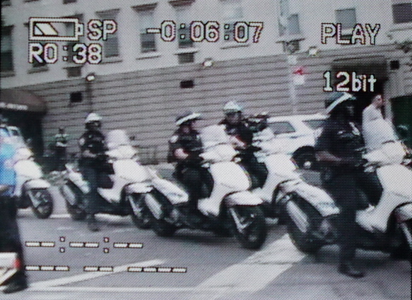
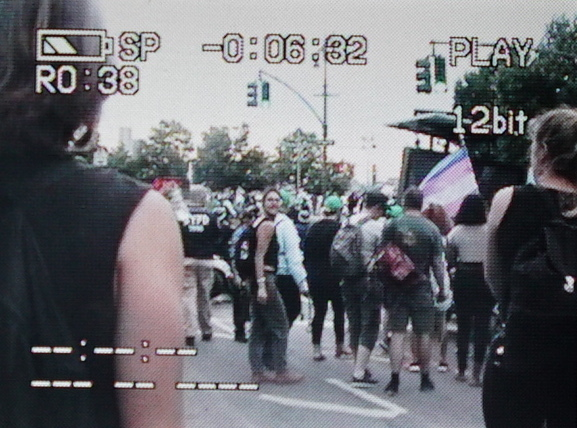
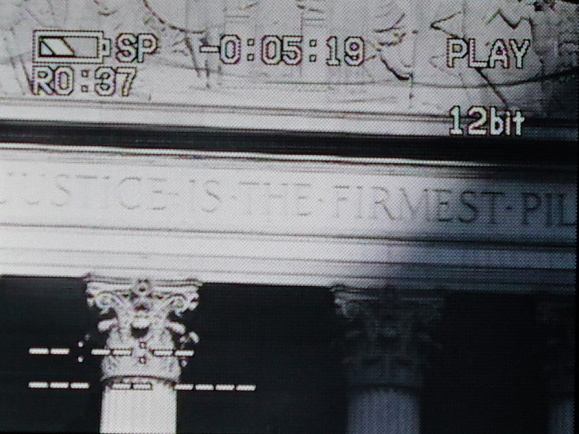

    

    
Dear Sayak, I wonder what you mean when you write that,

    <blockquote>
        

            “We must exercise caution as we engage in the deconstruction of the masculine gender. We cannot approach this work with foolish optimism, since we have to keep in mind that the deconstruction of hegemonic masculinity might lead us to construct new masculinities that end up being neither new nor desirable... the outcome can be unpredictable and dystopic, if we do not cultivate a radical self-criticality, understanding “radical” in its etymological sense as a return to the root of things” (Sayak Valencia, 2010/2018).
        

    </blockquote>
    

        I am interested in the structural implications of your writing — about what you mean by <em>deconstruction, masculine, gender</em> — but as I write this, I also wonder, what would you think about Chase Strangio’s appearance on <em>Democracy Now!</em> this morning? I don’t know if it was his deconstruction, his masculinity, or his gender, but his appearance made me feel possible on a day when the news was disorganizing. He made my friend Daniel cry. I wonder what you would think about the three of us, and whether our self-criticality is radical enough.
    

    

        I’m sitting in the back of the Solís lecture hall with the other <em>Diversity</em> Teaching Assistants. The class is called <em>Diversity — Dimensions of Culture I: Diversity</em>, the first of a three-course sequence in fulfillment of the University’s college writing program. The professor is introducing Kimberlé Crenshaw’s writing about intersectionality, setting up the idea that gender is a social construction that interacts with and complicates categories of race. She’s emphasizing that Crenshaw’s work comes out of that same moment of 90s identity politics that Omi and Winant’s theory of racial formations also comes out of. Our students had to read that last week. <em>War on Drugs</em>, she says, <em>Anita Hill, Clarence Thomas</em>. I scan two hundred backs of eighteen- and nineteen-year-old heads. I just listened to Chase Strangio’s interview on <em>Democracy Now!</em>, responding to the <em>New York Times</em> report that President Trump is proposing a legal definition of gender based on the genitals people are born with, and I am waiting for the professor to acknowledge the news. She doesn’t, but I feel it wash over the room.
    

    

        Chase appears on <em>Democracy Now!</em> as both attorney and witness, disaffected survivor. Representing the ACLU and Chelsea Manning and himself, he testifies to the fear and threats we are facing now, and to a long history of trans resistance.1 He explains that <em>The New York Times</em> is part of the problem.
    

    <blockquote>
        

            “Right now, federal civil rights law prohibits discrimination on the basis of sex. The courts have long understood that that includes discrimination against trans people and anyone who departs from sex stereotypes. So this is not new. <em>The New York Times</em> was incorrect in saying that the Obama administration, quote-unquote, ‘loosened’ the definition of gender or sex. That is not what happened. The law has been clear for decades. The Obama administration offered interpretive guidance consistent with that. The effort now is to offer new interpretation that will conflict with the federal law as interpreted by the courts. And so, this is not something that the Trump administration can do single-handedly, but it is an effort to exclude trans people from civil rights protections. And we have to stay vigilant.
        

        

            [...] I have long been very critical of <em>The New York Times’</em> trans coverage. And that’s true of yesterday’s article, as well. I think it was an incendiary headline designed to get clicks. It absolutely is true that trans people are under attack, but the idea that trans people’s existence is up for debate is precisely the paradigm that <em>The New York Times</em> has fueled over the years of its coverage, suggesting that there are two sides to an argument about whether trans people exist.
        

        

            Trans people exist, full stop. It is not up for debate... It is not an argument about whether people exist. We exist. And the more we have a ideological debate about whether or not it’s moral or ethical to recognize the existence of trans people, the more we’re going to embolden the Trump administration and other state-level government actors to act to take away our rights. This isn’t a debate” (Chase Strangio, 2018).
        

    </blockquote>
    

        I walk to the lecture hall through a sea of undergraduate students on skateboards and am aware of adjusting my pace so as not to collide. I’m thinking about all of the ways that I’ve felt ambivalent about being recognized and misrecognized by the state. I am tired of defining myself by my ambivalence, and decide privately that my masculinity is neither dystopic nor ambivalent. That said, to be honest, changing the gender marker on my driver’s license does not feel like a triumph. The new card prevents a certain kind of treatment from anyone who asks to see my ID, but it also has a chip in it.
    

    

        Dear Sayak, is my self-criticality radical enough to “return to the root of things”? Daniel tells me he doesn’t think about being a trans man in terms of masculinity. I tell Daniel to listen to the interview with Chase. He texts me that it made him cry. Later Remi tells me it made him cry too. Daniel thinks he cried because of Chase’s affect — which he identifies as an “isolation of affect: speaking about intense things while sounding detached.”2 Remi doesn’t tell me why it makes him cry, but says that he loves Chase.
    

    

        Dear Chase, What did you mean when you said that “the law has been clear for decades”? If I learn how to read the law will I learn how to understand its relationship to feeling?
    

    

        I tell our students to write for seven minutes, as much as they can. <em>Don’t think about what you’re writing too much.</em> As I speak to them I imagine they’re all trans.
    

    

        Write as much as you can. Try to trust yourself, and try to be patient at the same time. Don’t make any assumptions. Don’t judge anyone, especially yourself. Don’t worry if the words come out in the wrong order. Anyway, there is nothing straight about feeling and there is nothing straight about time. Especially legal time. 3
    

    

        While the professor talks about Anita Hill and Clarence Thomas, I look around the room. None of our students were alive in the 90s. I feel like they already know about intersectionality, that they have already internalized this on some level, but I wonder if I feel that way because I privately regard them as trans. I know it’s not fair of me to assume. Daniel tells me he does the same thing with his students, imagines they’re all trans.
    

    

<ol class="mendelsohn-footnotes">
    <li>
        <ol class="mendelsohn-dates">
            <li>
                <strong>1995</strong>: The city of San Francisco passes its first anti-discrimination ordinance specifically protecting the civil liberties of transgender people. This is the same year that “many formerly ‘gay and lesbian’ or ‘gay, lesbian, and bisexual’ organizations and events [begin] to add the T to their names.” Trans allies among the Lesbian Avengers at the Michigan Womyn’s Music Festival invite Camp Trans activists to enter into dialogue about the transphobic policies and attitudes upheld by the Womyn’s Festival (Susan Stryker, 2016).
            </li>
            <li>
                <strong>2003</strong>: The state of California adds gender identity to the list of identities protected by state anti-discrimination law. Sodomy laws are repealed in the Supreme Court ruling *Lawrence v. Texas* — overturning the case *Bowers v. Hardwick*, which upheld a Georgia law criminalizing oral and anal sex in private between consenting adults (which had passed 5-to-4 votes in 1986).
            </li>
            <li>
                <strong>2009</strong>: The Matthew Shepard and James Boyd Jr. Hate Crimes Prevention Act adds gender identity and/or expression as a protected category to federal hate crime law. The Human Resources Administration (HRA) Review Committee creates a grassroots organizing campaign to raise awareness and build public pressure demanding that HRA change its policies and practices, focusing on collective action by low-income trans people of color. New policy is won—though it’s a “watered down, thin version of the initially proposed ‘Best Practices’ document drafted by the 2005 committee” (Dean Spade, 2011).
            </li>
            <li>
                <strong>2012</strong>: Macy v. Holder rules that discrimination against transgender people constitutes illegal sex discrimination under Title VII — a landmark ruling for transgender rights in the U.S. — months after the Repeal of Don’t Ask Don’t Tell in the U.S. military, and CeCe McDonald is arrested in Minnesota for stabbing a man who violently attacked her on the street for being black and trans. The NYPD reopens the case of Marsha P. Johnson’s death to investigate the possibility of a hate crime resulting in her murder in 1992.
            </li>
            <li>
                <strong>2013</strong>: The largest philanthropic gift ever made toward trans-focused advocacy is given to the Palm Center by Col. Jennifer Pritzer: $1.35 million for their Transgender Military Initiative. One day after U.S. military court sentences Chelsea Manning to thirty-five years in prison for leaking confidential military documents to WikiLeaks, Manning releases a statement coming out as a transgender woman. Radical lawyer and transgender rights activist Chase Strangio starts working for the ACLU, joining the team representing Manning.
            </li>
        </ol>
    </li>
    <li>
        <ol class="mendelsohn-dates">
            <li>
                <strong>2014</strong>: A.B. 1266 takes effect in California, allowing trans and gender non-conforming K-12 students to use bathrooms, locker rooms, and participate in sports that are “congruent to their gender identity without regard” to the gender they were assigned at birth.” Facebook offers fifty-eight options for self-identifying one’s gender. Reports indicate that the U.S. federal government has “invested nearly $200,000 to study how transgender women use Facebook, which most certainly relies on self-identification information gained perhaps purchased, from the company” (Christine Quinan, 2017). Gender confirmation medical procedures are no longer required to change your gender on a new birth certificate in the state of California.
            </li>
            <li>
                <strong>2015</strong>: Barack Obama becomes the first U.S. President to be recorded using the word “transgender” in public in his 2015 State of the Union Address, in which he advocates that legalizing protections for LGBT people “make us [all] safer” (Susan Stryker, 2016).
            </li>
        </ol>
    </li>
    <li>
        <ol class="mendelsohn-dates">
            <li>
                <strong>2016-2017</strong>: “From 2016 to 2017 U.S. lawmakers submitted over 200 anti-LGBTQ bills to become laws. I sat on a bench outside the courthouse to end this ritual each day, leaning forward, then back, then side to side to feel the page of the bible up inside me, apostle Paul deep-fingering me as I read printouts of some of these laws...reminding me of the words of the great poet Audre Lorde, who said, ‘it is not our differences that divide us. It is our inability to recognize, accept, and celebrate those differences.’ I tire of these inabilities I will now shit out the cause. I will continue to Love this world despite the enemies of Love” (CAConrad, 2017). Cub Scouts of America announces they will start including trans cubs assigned female at birth. Jeff Sessions drops Attorney General Loretta Lynch’s lawsuit against North Carolina’s anti-transgender HB2. With a net worth estimated at $1.7 billion, Jennifer Prizker is reported to be the world’s first trans billionaire. She supports Donald Trump’s campaign for President, later speaking out against him.
            </li>
            <li>
                <strong>2018</strong>: President Trump releases a memo stating that “Sex means a person’s status as male or female based on immutable biological traits identifiable by or before birth.” I keep getting really hard thinking about you describing what you’re going to do to me before you actually do it — verbally describing, like from the passenger’s seat of my car while I’m driving. It’s a Toyota Corolla. You’re getting hard too and I can hear it in your voice. I’m not allowed to touch you. You describe dominating me and rubbing your dick on mine. You start moving closer and playing with my hair while I’m driving and you’re describing how big and hard our dicks are. You move closer and start whispering in my ear: <em>I’ll touch you when I can see how wet you are through your pants, when you’re dripping on the seat. Your dick is hard and dripping all over the seat. Completely exposed and throbbing. I touch the tip lightly. I touch and start grappling with your thighs. I slap the inside of your thighs over and over. I run my nails up and down and you feel them deeply on your skin.</em>
            </li>
        </ol>
    </li>
</ol>

    

---

###### ABOUT THE ARTIST
**Asa Lipman Mendelsohn** is from New York. He makes performances, film, and media projects
that develop through a process of recording, writing, and collaboration, often focusing on
personal relationships and desire as ways to navigate seemingly inaccessible infrastructures,
histories, and systems of power.

Asa works as an teacher and organizer, and often with other artists as a writer, editor, and
performer. He has performed and exhibited at venues including Kunsthalle Wien, Vienna,
Künstlerhaus Halle für Kunst und Medien, Graz, the Blanton Museum of Art, Austin, and
Anthology Film Archives, New York. Asa studied visual arts and anthropology at the University
of Chicago, and was a Fulbright Fellow in Vienna. He is currently an MFA candidate in visual
arts at the University of California, San Diego, where he is learning about voice and security,
passing and resistance. He is a 2019 Flaherty Film Seminar Fellow.

**Website**: [http://www.asamendelsohn.info/](http://www.asamendelsohn.info/)
