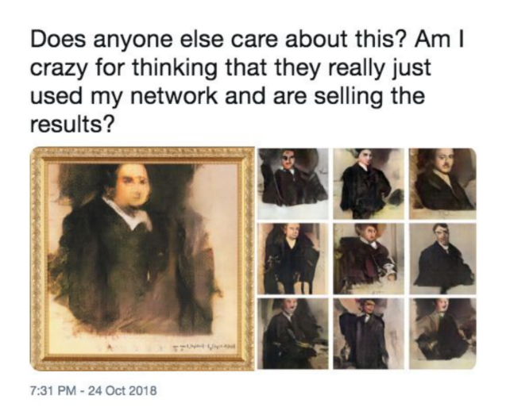
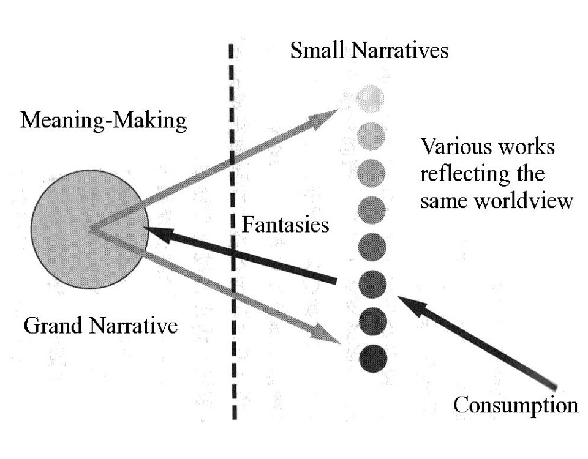
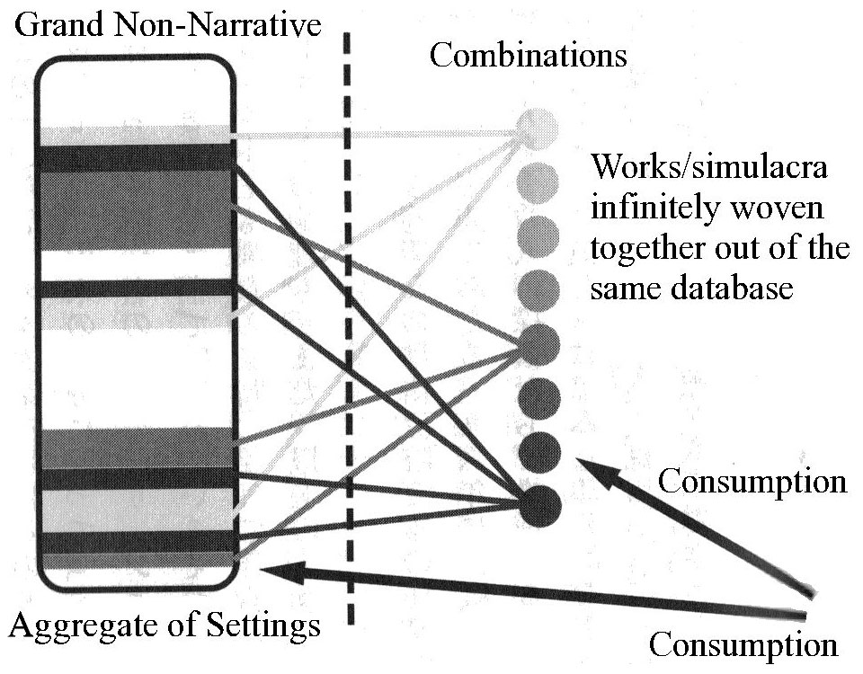
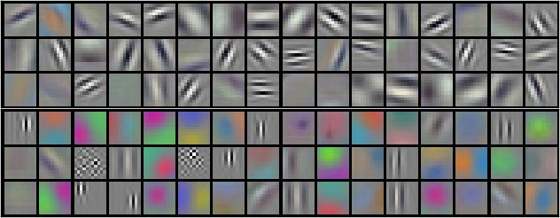
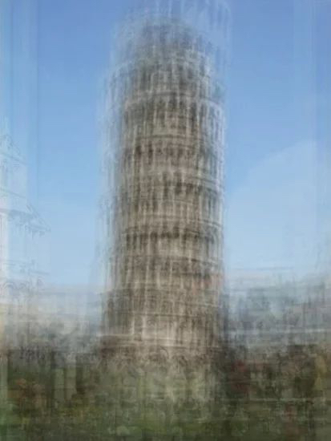
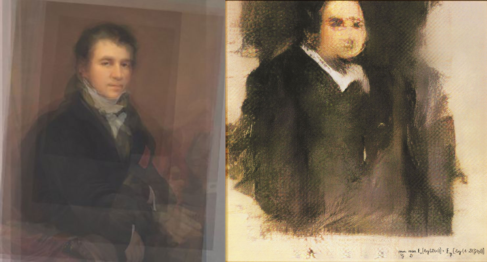

    

##### A side-by-side comparison of Portrait of Edmond de Belamy (2018) and example outputs from Barrat's open source code.
##### Source: A screenshot from Robbie Barrat's Twitter account.

### Freeware and $432,500

It was 2017 when 17-years-old Robbie Barrat was experimenting with a then newly available neural network framework called generative adversarial network (GAN) in his bedroom in rural America. While working on his own projects, Barrat made his software ("fun tools" as he called it) available online for free public use. This small act later became a part of a controversy in the Art World when it was discovered that "the first AI artwork" was sold at Christie's auction for $432,500 using Barrat's open source code without proper credit or compensation.

The artwork in the spotlight is Portrait of Edmond de Belamy (2018), a framed digital print from a family of portraits generated with a GAN software. The portrait presents a digitally reconstructed, glitchy figure that spares the viewer a set of minimally recognizable features: European, Caucasian, 17-19th century, affluent, male, gold framed, and oil painting. Its conceptual argument disclosed to the public were all at best hazy, even it was credited to an artist collective known as Obvious. However, the institutional validation established through this exchange was far clearer than what an average professional artist could afford in their lifetime. Over and above, the association with the $432,500 price tag and the headline "minimal human labor" alone was already sensational but safe enough for it to slip into a cocktail party or Now Trending on Twitter. The situation further escalated when Barrat tweeted a side-to-side comparison of the sold artwork with his old GAN project, Portrait GAN.

### Counterfeit Money

Amidst the controversy, there was a presence of a mysterious "AI system", a generative adversarial network (GAN) who allegedly created the artwork. Invented by an American computer scientist Ian Goodfellow in 2014, GAN is a recent addition to the deep learning frameworks. The framework is well known for producing systems with drastic improvement in image generation tasks, presenting images with higher resolution, "more natural" looking outputs with more defined edges . 3

The merit of GAN comes from its novel "adversarial" architecture distinctive from other ML generative models. Goodfellow uses the analogy of counterfeit money to explain the concept of adversary learning:

> The basic idea of GANs is to set up a game between two players. One of them is called  the generator. The generator creates samples that are intended to come from the same distribution as the training data. The other player is the discriminator. The discriminator examines samples to determine whether they are real or fake. [...] The generator is trained to fool the discriminator. We can think of the generator as being like a counterfeiter, trying to make fake money, and the discriminator as being like police, trying to allow legitimate money and catch counterfeit money. To succeed in this game, the counterfeiter must learn to make money that is indistinguishable from genuine money, and the generator network must learn to create samples that are drawn from the same distribution as the training data.

For a typical case of image generation, the generator starts out with random variables (= a noise field) and learns to estimate a function that that maps the given random variables to correct distribution of visual features. The discriminator, only knowing that a certain fraction of the images presented to it will be fake, learns how to correctly label the presented images whether they are from the original dataset ("real") or not ("fake"). These two players are linked internally via one mathematical expression, an objective function to be optimized, where the parameters linked to each player are designed to pit against each other 5. Through this "productive" competition, a GAN system will come up with an answer to how to mimic certain elements and tropes of image production.

Following this structure, the answer to whether GANs can produce images that will be stylistically recognized as an art piece becomes quite tangible under the conditions that: 1) it developed a good visual discriminator that closely resemble criteria used by a human viewer and 2) a generator that is capable of successfully "fooling" this discriminator. This tangibility has been excellently demonstrated in many open source image generation projects since 2016 (including Barrat's projects), where an endless stream of stylistic landscapes, nudes, furniture designs, fashion designs, logo designs, and portraits were produced.6,7,8 Furthermore, the rise of this type of "simulacrum" art production in the recent years, often closely tied to the interests of the market, had already been frequently discussed within the art world, such as the discussions on zombie-formalism.9,10

Coming back to the Belamy (2018) auction case, a set of questions surrounding the situation where "an artwork produced with 'minimum human labor' gets validated through the market" were originally only asked within the context of this tiny window of the art auction, or art market. To picture this sandbox environment in a higher resolution, let us take a look at how a contemporary art critic Sawaragi Noi sketched out the aesthetic validation process, inspired by the concept of "hyper-art" from Hilbert's metamathematics:11

> When we consider that an artwork has a certain value, there is no way for us to implicitly decide whether the artwork satisfies common rules of a hyper-art [art criticism]; but through answering a question whether we can 'hyper-formally' presume a relation between the new artwork and a specific artwork that is already certified by the languages of hyper-art [...]. Thus a newly minted artwork itself makes up the realistic rules of a hyper-art for validating other artworks.

Thus in this hyper-art context, the validation of an art piece is based on its distance from a discourse. In other words, material reality tied to the work (raw material cost but also technical skills and the amount of labor that went into the work) will easily collapsed into zero value, unless someone does the labor of connecting these properties with the strands of the official discourse at the moment, and organizing the necessary assumptions (or blind spots) that makes the work possible. Only through this carefully setting up sandbox, a validation system of an artwork can obtain a virtual space for "freedom." The conceptual structure of Belamy (with an accompanying claim of "minimum human labor") was built and posited in this framework and immediately collapsed as soon as it met Barrat's distress.

### GAN-ism

Now let us focus on the people behind the "free" AI labor, those who spend their spare time developing and promoting image generating GANs as open source. The rather non-generous label given to this subculture of creative coders is "GANism."12 When introducing these "the Art World" outsiders, Obvious quota tweet from François Chollet, a software engineer and the creator of Keras (one of the most popular open source neural network library) for their (informal) definition of "GANism": "GANism (the specific look and feel of seemingly GAN-generated images) may yet become a significant modern art trend." A lot of these "GANism" artists are closely engaged with open source communities, actively borrowing and contributing to online discussions and code reservoirs.

From an interview with Mario Klingemann, a German artist in residence at Google Cultural Institute and one of the biggest influencers of this community, we can get a glimpse of the relationship between these creators and their works:13

>A photographer goes out into the world and frames good spots, I go inside these neural networks, which are like their own multidimensional worlds, and say ‘Tell me how it looks at this coordinate, now how aboover here?’” Klingemann says. With tongue in cheek, he describes himself as a “neurographer.”

This kind of a distant attitude is strikingly different from how Anna Ridler presents her GAN artwork Mosaic Virus (2018): the artist carefully defends her choice of raw materials and connects the elements in her final work with corresponding historical contexts.14 On the contrast, Klingemann and Barrat both had mentioned that their interests mainly lie in the encounters with "interesting results" whiinteracting with their material (GANs) and, equally importantly, sharing the found joy with the world.

Such approach much resembles the sensibility of subculture artists, where the sharing of endeavor operates within a gift economy framework, centered around communal enjoyment relating to the object of appreciation. Both fanart and "GANism" art are created through the collaborative engagement with the database of existing cultural products, "playing" with the cultural database and dynamically recreating or remixing its elements for personal enjoyment and in-group social values.

In this sense fanart and GAN images are not simple "credible copies of existing works" as some would want to claim.15 The complex relationship between "the simulacra" and the original cultural materials in this mode of cultural consumption is well modeled in Azuma Hiroki's book, Otaku: Japan's database animals.

### Database Animals

    

        
    

    

     
    

##### The patterns of cultural consumption in the modernist world (left: a model with the Grand Narrative) versus in the new database-centric world (right: a model the Grand Non-Narrative).
##### Source: Azuma, Hiroki. Otaku: Japan's database animals. U of Minnesota Press, 2009.

In Otaku: Japan's database animals, Azuma examines the trends in Otaku culture (the anime/game fandom subculture in Japan) during the 2000s as a case study 16. Extending postmodernist analysis on literature, he identifies "the Grand Non-Narrative (a database)" as the central pivot for shifting the cultural consumption pattern.

This "shift" is after the poststructuralists such as post-Marxist Jean-François Lyotard and Hegelian philosopher Alexandre Kojéve who extensively discussed the deterioration of the modernist concept Grand Narrative (metanarrative) in the postwar western sphere. When a society run out of "the Others" to bring into their global discourse, conjuring a common goal or the spirit of the era becomes an extremely difficult task. For this case, a lot of postmodernists thought that what is left for these "post-historical" individuals will be focusing on satisfying their needs. For Kojéve, this kind of existence was "animalistic." Here is Azuma's reading on Kojéve's "animals":

>Animal needs can be satisfied without the other [...]. Consequently, 'becoming animal' means the erasure of this kind of intersubjective structure and the arrival of a situation in which each person closes various lack-satisfaction circuits.

Here, "animals" are people in a society without the struggles of "intersubjective structure," where there is no reason or means to maintain a discourse and everyone exists in harmony with their environment ("nature"). This concept is a value-neutral description of a state, that comes with a flat structure where all constituents unanimously agree on whatever horizontality they perceive.

Assuming such animalization in the contemporary Japanese society, Azuma starts the critical analysis on the otaku subculture. What Azuma newly observed in the Otaku subculture was the strong affinity toward consuming discrete fragments of an experience those are detached from its original contexts and sterilized into non-threatening elements. Azuma calls the totality of these fragments, flattened and organized around a rule-based system, "the database."

Then Azuma further claims that through this flattened structure of the database powered with algorithms for creating infinite "interesting" recombinations, the Otaku culture was able to build a perpetual drama engine that does not require "the Other" and the other. For the short human lifespan, this database engine is infinite enough to completely replace the traditional humanistic desire system, which required the hassle of "intersubjective structure."
After the database engine installed in their horizontal community, members of otaku culture now became database animals and started to present different kind of desire than Kojéve's "human" desire:

>[Data animals have] two completely different inclinations toward the surface outer layer (the drama) and toward the deep inner layer (the system) of a work. In the former they look for an effective emotional satisfaction through combinations of moe-elements [the database elements]. In contrast, in the latter they want to dissolve the very unit of the work that gives them such satisfaction, reduce it to a database, and create new simulacra.

The loop starts with a consumer with an existing database of a culture. Assuming the database is large enough, the consumer will find "at least one" work that would satisfy their emotional need. After entirely consuming this "strong" work, the consumer can jump to the next adjacent work in the database. Because of the second desire that Azuma described, sometimes the consumer themselves will create a new simulacra of the original work (just out of love) and this is immediately fed back into the database (sharing), further expanding the system. In the new market desire perpetuated with the Grand Non-Narrative engine, the hierarchy between the original and the copy or "the simulacra" is flattened in the data animals' mind: they are now just two different windows (frames, sandboxes) for combining cultural fragments from the same database, residing on the same plane. Thus the relation between "the copy" and "the original" in the mind of database animals diverges from the modernist views:

>A copy is judged not by its distance from an original but its distance from the database. [...] The authors of derivative works do not exhibit such an aggressive intent. [...] in the mind of the otaku, even if derivative works violates original works (at the level of the simulacra), the originality of the original works as information (at the level of the database) is protected and respected.

Within this framework, what should be driving the production of simulacra is pure love and respect toward "the original information," which is the shared value of the community. Therefore, "copying" is justified only in the context of expressing devotion toward the original, pure from other external reasons such as material or social gain.

If we generalize this analysis, open source GAN community and otaku culture seems to share many similarity (horizontality within the community, desire patterns toward the object of enjoyment). Otaku community's horizontal nature is established after the shared rejection of "the intersubjective structure." Similarly, open source community's horizontality is based on the agreement on the rejection of "copyright" removing the exchange value between labor (and skills) put into the project and its latent materialist value. Thus, what is remaining in the equation is close to "pure love (pursuing ideal)" and devotion to the original information (the knowledge).

The art market on the other hand, original-copy horizontality is prohibited from the root by the nature of markets (artificial scarcity). As we discussed in the previous section, the space allowing freedom (= horizontality) in the art context operates on a dynamic, shared artificial blind spots. When Obvious was building an "interesting" case within the context of art market, its artificial blind spot was the labor by the open source code they freely borrowed taken out of the context from the open source community. The "machine" labor executed by a code is indeed disembodied labor, but is it really free or “minimal human labor?” Even though there was no traditional copyright issue here, assuming GAN community shares similar value system to Azuma's otaku community, we can understand what code of conducts Obvious had violated in the eyes of an open source community.

### Surface-sliding

>Shortly after our eyes adjusted to the pace of the movement, we were able to make out an eye, a side of a nostril, then a tip of a lip, tossed in and out of a surface of melting features. The brief moment that we thought we grasped an impression of the whole face, the visual fragments had already twisted around and slipped away taking form of another impression.

Ever since the first implementation of GAN for image generation, many embarked an exploration into the endless horizon of images that GAN could immediately weave out. These are images, some say, that had "never existed": anime girls, celebrity faces, fashion models, fashion itself, famous painting, ramen, weird animals, strange buildings, unfamiliar landscape, barely illegible symbols...

    

##### A visualization of the first convolutional kernel layer learned by a deep computer vision applications, ImageNet (2012). This is an example of the lowest level visual units used in major computer vision and image construction applications. Barrat's DCGAN (deep convolutional GAN) system also relies on convolutional layers.
##### Source: Alex Krizhevsky (author's permission to reproduce) 17

After establishing a new desire model for database animals, Azuma argues that the modern notion of transcendence ("moving back to the invisible, entry into the symbolic") will be flattened into what he calls "slipping sideways":

>[...] the desire to transform as many invisibles as possible into visibles, without arriving at the agency at the final level, and to extract as many simulacra as possible from the database. [...] this trying without success to go back from the visible (small narratives, i.e. simulacra) to the invisible (the grand narrative, i.e., database) and, instead, slipping sideways at the level of small narratives is the structure of misfire [...]

It is hard to ignore that the enthusiasm around GAN is a symptom of this new desire model. To examine the situation within the logic of the endorsers of GAN creativity, let us temporarily put aside Azuma's verdict on "slipping sideways." Which of these two feel more viable (and enjoyable): keywords like exploration and experience versus words like contemplation and transcendence?

In the flattened cultural landscape of sliding, no cognitive or emotional effort is required to be wasted for a vainful task such as penetrating into the intangible. Everything is (and should be) already on the surface. In the culture of sliding sideways, the "real problem" is there are too many things to indulge in our limited time. A "simple solution" to this is to devise a filter or a guidance for shifting through the ocean of images, thus "curation as creativity" was quickly accepted into the cultural industry.

Since the dawn of mechanical production, technique and labor associated with an artwork had become a factor that could be independent from the art-making process. Filling out the vacuum that is created by the shrinkage of craft and the surplus of idea, is curation. A curator is "a junction-maker," and to curate is "to safeguard the heritage of art, to connect to art history, to display/arrange the work, and to setup an extraordinary experience" paraphrasing Hans Ulrich Obrist . Looking at this, curation exists 18 somewhere among finished artwork, the art history, and people seeking for an art experience.

There seems to be a reason why beneficiaries of GAN and creativity, who rarely comes from a background of cultural production (regardless of fine arts, design, or subculture), love to endorse creativity as curation . If we agree to reduce the whole art-making process into "a pipeline," any person 19 (without production skills and detached from the socio-historical context) could gladly take over the curator/editor (or even more reduced form, an explorer) role in the system while delegating the significant portion of the art-making to their very talented toolkit. This is a horizontality that can be enjoyable for "any person" and surely will accelerate a certain type of art production.

    

##### Pisa from Photo Opportunities by Corinne Vionnet (2005 - Ongoing).
##### Source: "Photo Opportunities: An Interview with Artist Corinne Vionnet" 20

### Decision Making Machine

This is a good time to remind ourselves that the current machine learning technology does not deviate too far away from making a nice statistical model, even in the eyes of the pioneering computer scientists. Quoting just one, Turing award winner Judea Pearl flat-out said that even the most advanced front of the deep learning "all stuck there on the level of associations. Curve fitting." in a recent interview. 21

The motivation for statistical methods and machine learning is our curiosity and anxiety. It is to better understand a seemingly random world by discovering a pattern in a dataset. No matter how mesmerizing its output image can be, GAN is simply making "new samples" based on an approximated description of a given dataset. Similarly, no matter how mysterious "AI" algorithm behind Portrait of Edmond de Belamy is marketed, its GAN model is generating new portraits based on a statistical model, which successfully estimates a compression of a massive collection of European, Caucasian, affluent, male, and gold framed digital images.

Trimming away the drama, the core labor of Belamy project lies on connecting this specific dataset with the context of the Christie's art auction. The fact that GAN was able to synthesize a somewhat recognizable image implies the abundance of samples, massive enough to adequately feed a data-hungry deep learning model. We think comparing Belamy with Photo Opportunities by artist Corinne Vionnet here will be helpful. Photo Opportunities is a series of composite images made by collecting and layering online tourist photos. The blurred images of famous landmarks elegantly show how the individual perception by its visitors converge and then deviate, utilizing the simplest and yet powerful statistical method: finding an average.

    

##### (Left) A composite image of ten 17th-19th century European male portraits from WikiArt. (Right) Portrait of Edmond de Belamy (2018).
##### Source: (Left) the author of the article. (Right) Wikimedia (public domain).

On the contrary, an image generated with GAN, such as Belamy, presents an image without the blurring despite the fact that it also is a reflection of a large dataset. This highlights a property of GAN that Goodfellow calls "multi-modality," where the model considers multiple (definite) scenarios for a given prediction task.

What lies between an empty canvas and a finished painting? If a painting is the finished work minus its original state (a blank canvas), painting is an accumulation of (intentional and unintentional) decisions on a surface. In this perspective, it seems irrefutable that the majority of art-making process is owning up each of these made decisions. However, what if your art-making involves an interaction with a system that constantly surprises you to the point that it predetermines the majority of the art-making decision-making steps? This question is well anecdoted in a relayed discussion between Dr. Ahmed Elgammal and artist Casey Reas in the recent Atlantic article, regarding a problem of positioning AI as a collaborator in art-making : 22

> Elgammal [...] thinks the worry ["an artificial intelligence taking over for visual artists"] is misplaced. “I’m more into collaboration now,” [...] But it’s odd to list AICAN as a collaborator—painters credit pigment as a medium, not as a partner. Even the most committed digital artists don’t present the tools of their own inventions that way; when they do, it’s only after years, or even decades, of ongoing use and refinement.

> But Elgammal insists that the move is justified because the machine produces unexpected results. [...] “Using a tool is an unfair term for AICAN. It’s the first time in history that a tool has had some kind of creativity, that it can surprise you.” Casey Reas, a digital artist who co-designed the popular visual-arts-oriented coding platform Processing, which he uses to create some of his fine art, isn’t convinced. “The artist should claim responsibility over the work rather than to cede that agency to the tool or the system they create,” he told me.

When an artist position a system (=tool) as collaborator, they are intentionally delegating certain part of artistic process. For the case of GAN art, important questions, from philosophical "problem of representation" to technical ones such as "how to design a system of visual features for composing a representation," are flatly-delegated to the architecture of GAN system. Yet another risk is that, often times relying on this delegation can allow one to overlook aesthetical and technical decisions embedded in the setup that appears seem trivial. Repeating what has been discussed, taking an aesthetical stance for a work means that the artist will be responsible for any aesthetic argument for all decisions involved in the process: obvious, random, intrinsic, extrinsic, deliberate, accidental, personal, and trivial decisions, all of them. Therefore when a project leaves the dimension of personal enjoyment and reposition itself as an art, it soon cannot avoid multi-dimensional criticisms (for example, for the lack of sensibility for perpetuating cultural trauma hiding in the training dataset an artist selected) . 23

In a landscape of delegated labor, expertise, embarrassment, and responsibility, drama propagates faster than a discourse, and drama sells well. Within this flattened culture, it is confusing who can and how they can ask for "surface-penetrating" endeavor from anyone else. We also witness that crossing the straits of isolated flat landscapes, a value system cultivated in one landscape can be easily collapsed and utilized without a consequence.
Before wrapping up, we would like to add some residual questions that should (or should not) stay in the context of art-making: up to which level of decision-making are we willing to delegate to machines? Are we appropriately considering the cost of this delegation? Which delegated endeavor gets flattened? Is the delegation even possible for you to "repay"? Nonetheless, we seem to invent more ways to dilute any risk, every year.

---

<!-- Footnotes and Citations -->

1 https://twitter.com/drbeef_/status/1055285640420483073 from Robbie Barrat's twitter account 
2 https://www.wired.com/story/teenagers-code-spawned-dollar-432500-piece-of-art/ 
3 Ledig, Christian, Lucas Theis, Ferenc Huszár, Jose Caballero, Andrew Cunningham, Alejandro Acosta, Andrew Aitken et al. "Photo-realistic single image super-resolution using a generative adversarial network." In Proceedings of the IEEE conference on computer vision and pattern recognition , pp. 4681-4690. 2017. 
4 Goodfellow, Ian. "NIPS 2016 tutorial: Generative adversarial networks." arXiv preprint arXiv:1701.00160 (2016). 
5The small writing at the right bottom corner of Portrait of Edmond de Belamy is the mathematical expression: "𝒎𝒊𝒏 𝑮 𝒎𝒂𝒙 𝑫 𝔼𝒙 [𝒍𝒐𝒈 𝑫 (𝒙))] + 𝔼𝒛 [𝒍𝒐𝒈(𝟏 − 𝑫(𝑮(𝒛)))]" 
6 https://github.com/robbiebarrat/art-dcgan 
7 https://medium.com/@creativeai/creativeai-9d4b2346faf3#b837 
8 https://medium.com/@jonathan_hui/gan-some-cool-applications-of-gans-4c9ecca35900 
9 https://news.artnet.com/opinion/history-zombie-formalism-1318352 
10 https://www.artspace.com/magazine/contributors/see_here/the_rise_of_zombie_formalism-52184 
11 Sawaragi, Noi. 1998. "Art is Explosion" in Nihon, gendai, bijutsu, trans. A. Chung , Shinchosa Publishing, Tokyo. 
12 https://medium.com/@hello.obvious/ai-the-rise-of-a-new-art-movement-f6efe0a51f2e 
13 https://www.wired.com/story/neurographer-puts-the-art-in-artificial-intelligence/ 
14 https://hyperallergic.com/487261/anna-ridler-tulipmania/ 
15 https://www.theatlantic.com/technology/archive/2019/03/ai-created-art-invades-chelsea-gallery-scene/584134/ 
16 Azuma, Hiroki. Otaku: Japan's database animals . U of Minnesota Press, 2009. 
17 Krizhevsky, Alex, Ilya Sutskever, and Geoffrey E. Hinton. "Imagenet classification with deep convolutional neural networks." In Advances in neural information processing systems , pp. 1097-1105. 2012. 
18 https://www.theguardian.com/artanddesign/2014/mar/23/hans-ulrich-obrist-art-curator 
19 https://www.artsy.net/article/artsy-editorial-art-failing-grasp-christies-ai-portrait-coup 
20 https://petapixel.com/2013/10/23/photo-opportunities-interview-artist-corinne-vionnet/ 
21 https://www.quantamagazine.org/to-build-truly-intelligent-machines-teach-them-cause-and-effect-20180515/ 
22 https://www.theatlantic.com/technology/archive/2019/03/ai-created-art-invades-chelsea-gallery-scene/584134/ 
23 http://rhizome.org/editorial/2018/apr/18/blobs-of-flesh-categorized-as-human/ 

---

###### ABOUT THE ARTIST
**Mira C** is a transdisciplinary something based in San Francisco. They write and draw about rumors, speculations, drama, and hopes surrounding a candidate of disruptive innovation.

Website: [https://medium.com/@mirarim ](https://medium.com/@mirarim)

