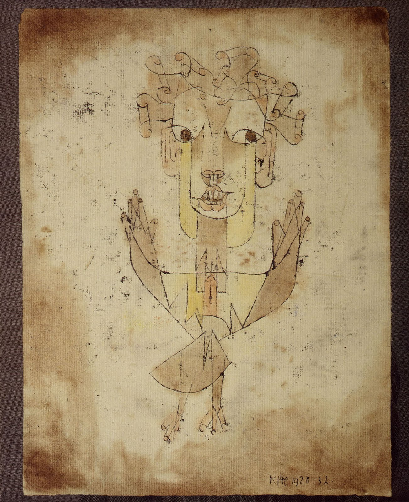

### Issue #0.1 HALT

  

    Currently accepting submissions through <strong>June 15, 2020</strong>. Submit your work <a href="https://airtable.com/shryYmahmx0tJUxri">here</a>.
  

  

    <figure style="max-width: 500px; margin: 0 auto 50px">
      
      <figcaption class="caption" style="margin-top: 20px">
        Paul Klee, Angelus Novus, 1920, Oil transfer and watercolor on paper, 31.8 x 24.2 cm.Courtesy of Israel Museum, Jerusalem
      </figcaption>
    </figure>
    <blockquote>
      This is how one pictures the angel of history. His face is turned towards the past. Where we perceive a chain of events, he sees one single catastrophe which keeps piling wreckage and hurls it in front of his feet. The angel would like to stay, awaken the dead, and make whole what has been smashed. But a storm is blowing in from Paradise; it has got caught in his wings with such a violence that the angel can no longer close them. The storm irresistibly propels him into the future to which his back is turned, while the pile of debris before him grows skyward. This storm is what we call progress.
      <footer>
        —Walter Benjamin on Paul Klee’s <em>Angelus Novus</em> from <em>Theses on the Philosophy of History</em>, 1940
      </footer>
    </blockquote>
  

Dear readers, clickers, lookers, and listeners,

Prior to the COVID-19 outbreak, in the fall of 2019, the editors of FLAT journal convened to discuss the theme of the journal’s second issue. The theme and title of the journal would be a call to inaction, “HALT.” But little did we know at that time just how imminent a total world “halt” was. And now that something appearing like a halt is here, do we really want it? Is it enough? Is it really a halt at all?

Let’s bracket, for a moment, COVID-19, and ask why originally wanted to pose this sudden call to inaction?

> Since the year 2010, Facebook has [gained 2 billion users worldwide](https://www.statista.com/statistics/264810/number-of-monthly-active-facebook-users-worldwide/); a youtube video [reached 200 million views in 24 hours](https://www.statista.com/statistics/478082/fastest-viral-videos-views-in-24-hours/); Instagram has redefined celebrity in the attention economy, causing over [259 selfie deaths](https://www.ncbi.nlm.nih.gov/pmc/articles/PMC6131996/); and over [200 million people](https://www.statista.com/statistics/545876/number-of-people-displaced-due-to-disasters-worldwide/) have been displaced due to disasters worldwide. Americans perceive that the continued development of automation technologies will result in decreased numbers of job opportunities, and similar fears abound in a world in which, as [Paul Virilio](https://mitpress.mit.edu/books/administration-fear) puts it, social technologies are used to synchronize mass emotion. In response to this, the last decade concluded with authors like Jenny Odell (How to Do Nothing), Jia Tolentino (Trick Mirror), Astra Taylor (from The People’s Platform to Democracy May Not Exist…), Jaron Lanier (Ten Arguments for Deleting Your Social Media Accounts Right now), and Ted Chiang (Exhalation), subtly or not so subtly telling us to turn around and look at ourselves in a moment of pause. How could we reflect on what we have done with the last ten years without slowing, turning, and halting -- our eyes wide and mouth agape, as though goosenecking past an accident on the highway?
>

Well, the accident has come and we are stuck in traffic, staring at it; a decade of accelerated technological development–without the equivalent in social change–has come to an eerily “socially distant” and deadly stand still. We entered the 10s with calls to Occupy Everything, and started the 20s only able to occupy our homes, if we are lucky enough to have homes. Is this the moment of reflection we were looking for when we wrote the paragraph above 6 months ago?

It feels like we’ve stopped, but have we? Is this halt truly a pause if we are all slowing down at different rates? As the economy and “business as usual” takes severe blows, it is the working class whose livelihoods are most at risk. Over [22 million Americans have filed for unemployment](https://www.washingtonpost.com/business/2020/04/16/unemployment-claims-coronavirus/) while millions of others are forced to work under precarious conditions. Many of whom, jobless or not, do not know how they will provide rent, mortgage and medical payments, or food for their families. This looming dispossession on people’s minds has been something the unhoused have faced for decades. When the rest of us become just as vulnerable, will we sense the urgency to address dispossession? Does every living body deserve the right to live? Even if they can’t be productive, even if their sense of progress may falter?

The engines of capital, entertainment, commerce, education, grind on. There is no doubt we are experiencing a profound and abrupt shift in social proxemics. From “social distancing” to the screen-based telepresencing of boardrooms, classrooms, and birthday parties, we are living in a new social milieu, one built for beings that see and hear, but don’t touch, or smell, or taste. What new cultures are emerging through the use of these media? What does it mean to be “socially” distant? And in a socially distant society, where does the burden of social responsibility fall and fail? How will media technology, and/or the related arts, change as a result of this halt?

So we begin the new decade with an interruption; one the consequences and quality of which is as yet, in April, unclear. Our question may be temporal. With the ever increasing fragmentation of time enabled by technologies and enforced culturally by the market, is halting this acceleration of reality possible? Is it desirable? Is opting-out an option? Can we really just prefer not to? So under these new conditions, living a counterfactual to our original proposition, we ask again, What does halting mean to you?

FLAT Journal uses a rolling submission process. We are currently accepting submissions for issue #0.1 through June 15, 2020 that specifically, broadly, or abstractly, address the theme of “HALT,” in relation to COVID-19 or not.

In general, FLAT journal looks for works relating to the intersection of visual and conceptual art, technology, and / or media.

The following types of original, new or previously published works are welcome:

* Theory / criticism / scholarly research in writing or writing with images
* Interviews
* reviews of art works, software, films, television, or other media
* Fiction, poetry, sound
* Photo essays, photography, digital images
* Illustrations, animations, videos
* Instruction based works, software, interactive media

Past publication or experience is not required. Other content types may be accepted. Direct questions to [flat@flatjournal.com](mailto:flat@flatjournal.com) with subject line “JOURNAL INQUIRY”

### Final Submissions Due May 1 should include:

* Abstract (100 - 500 words)
* Full plain text document (.rtf, .doc, .html, or google doc are preferred)
* Artist’s or Author’s short bio
* Links to author’s site or other published relevant works
* Any useful supporting images / media
* Images should be jpg, 1200px on one side (if your work is chosen, we will request high resolution images at 3000px)
* For videos or interactive media, please provide a link

 Your work will be reviewed by our 2020 editorial board for consideration. If your work is chosen for this issue, your content will be shared on our web-based platform (see our first issue), at the designers’ discretion. If you have specific requirements to make your work viewable in the ideal fashion, please let us know, we can work with you collaboratively, especially for interactive or complex media types.

Submit your work [here](https://airtable.com/shryYmahmx0tJUxri).

_Please note: at this time, this is unfortunately not a paid opportunity. Additionally, the 2020 editorial board for FLAT has yet to be announced. All rights to submitted and published works remain the sole property of authors, artists, and contributors._

### ABOUT FLAT JOURNAL

FLAT is a platform for theoretical and critical texts, interviews, reviews, projects, and experiments that engage with contemporary conversations surrounding emerging media in the arts. FLAT is open to submissions of writing, images, video, interactive works, and almost any possible form of web-based content from writers, artists, and thinkers around the world. Please see open calls for specific information about what themes and media we are accepting at this time. Contributors to FLAT include theorists, technologists, and artists from the UCLA community, the greater Los Angeles area, and beyond. At this time, FLAT publishes content online in both a themed issue and on a rolling basis and prints one physical publication a year. FLAT is designed, curated, and produced by faculty, graduate students, and undergraduates from UCLA’s department of Design Media Arts as well as faculty from the School of Art at Carnegie Mellon University.

FLAT is made possible through the support of the [UCLA Department of Design Media Arts](http://dma.ucla.edu/) and the [UCLA Arts Conditional Studio](http://software.arts.ucla.edu/).

